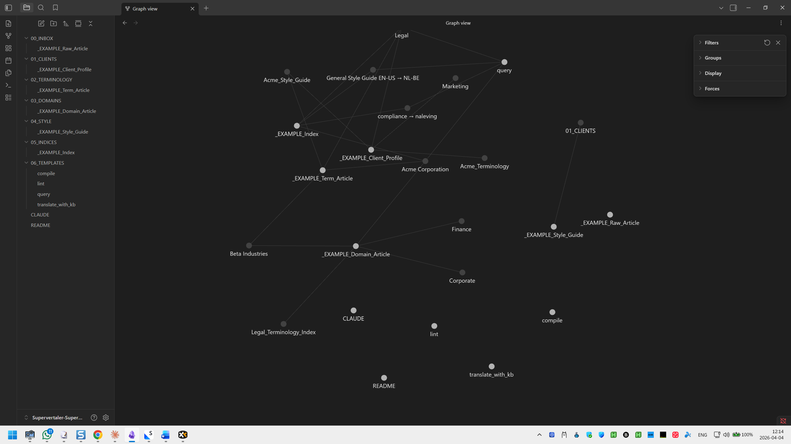

# Supervertaler for Trados

**Terminology insight, AI translation, and knowledge management for Trados Studio**

Supervertaler for Trados is a Trados Studio plugin (.sdlplugin) that brings terminology management, AI-powered translation, cross-file search, and a translation knowledge base directly into Trados Studio. It includes **TermLens** (inline terminology), **SuperSearch** (cross-file search & replace), **AI Assistant** (project-aware chat), **Batch Translate & Proofread**, **SuperMemory** (self-organising translation knowledge base), and **Clipboard Mode** (use any web-based AI without an API key). It relates to Supervertaler Workbench as follows:

- Supervertaler Workbench – free, open-source, standalone tool (Windows/Mac/Linux)
- Supervertaler for Trados – paid plugin (Windows-based, but can run on Mac/Linux via virtualisation, e.g., using Parallels Desktop)

**Screencasts:** [Supervertaler for Trados playlist on YouTube](https://www.youtube.com/playlist?list=PLKzCjqTaOj20o4zyXAWmOR-e3ZHG4_NLU)

**Documentation:** [help.supervertaler.com/trados/](https://help.supervertaler.com/trados/) – the unified help site for both Supervertaler for Trados and Supervertaler Workbench (Astro/Starlight on Cloudflare Pages, migrated off GitBook in May 2026). Source Markdown lives in [Supervertaler-Help](https://github.com/Supervertaler/Supervertaler-Help) (formerly served from this repo's `docs/` directory; moved out so docs and plugin code can evolve independently).

## Pricing

| Plan | Price | Features |
|------|-------|----------|
| **Free trial** | 14 days – no credit card required | Full access to all features |
| **Supervertaler for Trados** | €20/month or €200/year (2 months free) | All features included |

Purchase a licence at [supervertaler.com/trados](https://supervertaler.com/trados/).

## Privacy & Security

This plugin makes **no network calls** except to:
1. **Your chosen AI provider** (OpenAI, Anthropic, Google Gemini, Grok/xAI, or local Ollama) – only when you use AI features
2. **Lemon Squeezy licence API** – for licence activation and periodic validation (sends only your licence key and a hashed machine fingerprint)
3. **Anonymous usage statistics** (strictly opt-in) – if you choose to opt in, a single lightweight ping is sent on startup containing only: plugin version, OS version, Trados version, and system locale. No personal data, no translation content, no termbase information. You can opt out at any time in Settings.

Your API keys are stored locally in your Supervertaler data folder (`~/Supervertaler/trados/settings.json` by default) and are never transmitted anywhere except to your chosen AI provider. The full source code is available here for security audit.

## TermLens – inline terminology display

TermLens renders the full source segment word-by-word in a dedicated panel, with glossary translations displayed directly underneath each matched term. Translators see every term match in context – from both Supervertaler termbases and MultiTerm .sdltb termbases attached to the active Trados project.


### How it works

As you navigate between segments in the Trados Studio editor, the TermLens panel updates automatically. It shows the source text word-by-word, scanning it against your loaded termbase. Each matched term appears as a coloured block with the target-language translation directly below it – so you can see all terminology at a glance.

### Features

- **Dedicated terminology panel** – source words flow left to right with translations directly underneath matched terms
- **MultiTerm termbase support** – automatically detects .sdltb termbases attached to the active Trados project and displays their terms as green chips alongside Supervertaler terms; read-only, auto-refreshes when terms are added via Trados's native interface
- **Colour-coded by glossary type** – mark glossaries as "Project" in settings to show their terms in pink; all others appear in blue; non-translatable terms appear in yellow; MultiTerm terms appear in green
- **Non-translatable terms** – mark brand names, product codes, or abbreviations that should stay the same across languages; Ctrl+Alt+N to quick-add, or right-click any term to toggle; the source term is copied verbatim as the target
- **Abbreviation fields** – add source and target abbreviations to any term entry (e.g., GC for gaschromatografie); when the abbreviation appears in a segment, TermLens highlights it and shows the abbreviated translation; supports pipe-separated variants (`GC|G.C.|gc`) so all common forms are recognised
- **Case-sensitive matching** – optional global setting plus per-termbase override (Default / Sensitive / Insensitive); useful when abbreviations like "GC" must not match "gc"
- **Multi-word term support** – correctly matches phrases like "prior art" or "machine translation" as single units
- **Click to insert** – click any translation to insert it at the cursor position in the target segment
- **Alt+digit shortcuts** – press Alt+1 through Alt+9 (or Alt+0 for term 10) to instantly insert a matched term; two-digit chords supported for 10+ matches
- **TermPicker** – press Ctrl+Down to browse all matched terms and their synonyms in a list, with expandable synonym rows (sibling surface to TermLens: same termbase data, different ergonomics)
- **F2 expand selection** – make a rough partial selection across word boundaries, press F2, and the selection snaps to complete words; great for verifying source-target alignment in long segments
- **Add terms from the editor** – right-click to add a new term from the active segment's source/target text, with or without a confirmation dialogue; partial selections are auto-expanded to full words
- **Adjustable font size** – A+/A- buttons in the panel header for quick on-the-fly size changes, or set the exact size in Settings; persists across restarts
- **Read/Write/Project termbase selection** – choose which termbases to search (Read), which receive new terms (Write – multiple allowed), and which is the project glossary (Project)
- **Standalone database creation** – create a fresh Supervertaler-compatible termbase database from the Settings dialogue, no external tools required
- **Glossary management** – add and remove individual glossaries inside a database directly from Settings
- **Bulk Add NT** – paste multiple non-translatable terms at once (one per line) from the Termbase Editor; duplicates are automatically skipped
- **Duplicate prevention** – all insert and update paths check for existing entries with the same source+target in the same termbase, preventing accidental duplicates
- **Merge prompt for similar terms** – when adding a term whose source or target already exists with a different translation, a dialogue offers to add the new text as a synonym of the existing entry instead of creating a near-duplicate; includes an "Add & Edit…" option to review metadata before saving
- **TSV import/export** – bulk import and export terms in Supervertaler's TSV format (tab-separated, pipe-delimited synonyms, `[!forbidden]` markers, UUID tracking)
- **Help / About** – "?" button in the panel header shows version, keyboard shortcuts, and links to documentation and support
- **Supervertaler-compatible** – reads and writes Supervertaler's SQLite termbase format directly, so you can share termbases between both tools
- **Auto-detect** – automatically finds your Supervertaler termbase if no file is configured
- **Settings backup and restore** – export and import all plugin settings from the Backup tab; great for upgrading or transferring your setup to another machine
- **One-click update** – notifies you when a newer version is available on GitHub; click "Install Update" to download and install it directly, then restart Trados
- **Remembers layout** – dialogue sizes and column widths are saved and restored between sessions

### Screenshots


---


---


## SuperSearch – cross-file search & replace

SuperSearch lets you search across **all SDLXLIFF files** in your Trados project – not just the file you have open. Find & replace in target text, with regex support, match highlighting, a preview pane, and click-to-navigate.

📺 [Watch the SuperSearch demo](https://youtu.be/549Ulc92FiU) (3 min)

### Features

- **Cross-file search** – searches all SDLXLIFF files in your project at once
- **Source, target, or both** – choose which columns to search
- **Match highlighting** – matching text is highlighted in yellow in the results grid
- **Preview pane** – click a result to see the full source and target text in a resizable preview below the grid
- **Click-to-navigate** – double-click any result to jump to that segment in the editor
- **Find & Replace** – replace matches in target text across files, with confirmation
- **Regex support** – use .NET regular expressions with capture group replacement
- **Case-sensitive** – optional case-sensitive search
- **File selection** – include or exclude specific files from the search
- **Keyboard shortcut** – press **Alt+S** to open; select text first to search for it instantly

---

## QuickLauncher – one-click AI prompts

QuickLauncher puts your most-used AI prompts in the editor right-click menu. Select a word or phrase, press **Ctrl+Q** (or right-click → QuickLauncher), choose a prompt, and the AI Assistant receives the expanded prompt with the current segment context already filled in.

Prompts support nine variables: `{{SOURCE_LANGUAGE}}`, `{{TARGET_LANGUAGE}}`, `{{SOURCE_SEGMENT}}`, `{{TARGET_SEGMENT}}`, `{{SELECTION}}`, `{{PROJECT_NAME}}`, `{{DOCUMENT_NAME}}`, `{{SURROUNDING_SEGMENTS}}` (configurable context window with actual Trados segment numbers), and `{{PROJECT}}` (all source segments numbered – useful for full-document queries on important projects). Any `.svprompt` file with `category: QuickLauncher` in its frontmatter, or placed in a `QuickLauncher` folder, appears in the menu automatically and is shared with Supervertaler Workbench via the shared prompt library.

## Text Transforms – local find-and-replace

Text transforms are a special type of QuickLauncher prompt that runs local find-and-replace operations on the active target segment – instantly, without calling an AI provider. Useful for cleaning up invisible characters (InDesign U+2028 line separators, zero-width spaces, etc.) or normalising punctuation.

- **Built-in "Strip U+2028" transform** – removes invisible Unicode LINE SEPARATOR and PARAGRAPH SEPARATOR characters from the target segment
- **Simple rule format** – `find:` / `replace:` pairs in the prompt content body with `\uXXXX` Unicode escape support
- **Tag-safe** – modifies text content while preserving all formatting tags (bold, italic, etc.)
- **Clipboard copy** – cleaned text is automatically copied to the clipboard
- **Create your own** – set `type: transform` in the YAML frontmatter and write your rules in the content body
- **Keyboard shortcuts** – assign to Ctrl+Alt+1–0 slots like any other QuickLauncher prompt

---

## AI Assistant – project-aware chat

The AI Assistant is a separate dockable panel in Trados Studio that provides a multi-turn chat interface with full project context. Ask questions about the current segment, request alternative translations, or get explanations – all with your terminology and TM matches built into the conversation.

### Features

- **Dockable chat panel** – dock it right, bottom, floating, or on a second monitor; position and size persist across sessions
- **Project-aware context** – the assistant automatically sees the current segment (source + target), matched termbase terms, and optionally TM fuzzy matches
- **File attachments** – attach images (paste, drag-drop, or browse) and documents (DOCX, PDF, PPTX, XLSX, CSV, TMX, SDLXLIFF, TBX, TXT, Markdown, HTML, and more) for context; images use each provider's vision API, documents are text-extracted and sent as context
- **Quick model switching** – click the provider/model label at the bottom of the chat to switch models instantly via dropdown, without opening Settings
- **Apply suggestions** – right-click any assistant response and choose "Apply to target" to insert the suggestion directly into the active segment
- **Markdown rendering** – responses render with full formatting: headings, bold, italic, inline code, code blocks, tables, and lists
- **AI context control** – choose which termbases contribute to AI prompts and toggle TM match inclusion from the AI Settings panel
- **All providers supported** – OpenAI, Anthropic (Claude), Google (Gemini), Grok (xAI), Ollama (local), and custom OpenAI-compatible endpoints

## AI Batch Translation

Supervertaler for Trados includes built-in AI translation powered by OpenAI, Anthropic, and Google LLMs. Translations are glossary-aware – matched terms from your TermLens glossaries are injected into the AI prompt so the model respects your approved terminology.

### Features

- **Batch translate** – translate multiple segments at once from the Batch Translate tab; choose from four scopes: empty segments only, all segments, filtered segments, or filtered empty only
- **Single-segment translate** – press **Ctrl+T** to translate the active segment using the same settings as Batch Translate (provider, model, prompt); also available via right-click → "Translate active segment"
- **Filtered segment support** – use Trados's advanced display filter to narrow down which segments to translate, then batch-translate only those
- **Multiple AI providers** – OpenAI (GPT-4o, GPT-4o Mini, GPT-5, o1, o3), Anthropic (Claude Sonnet 4.6, Haiku 4.5, Opus 4.6), Google (Gemini 2.5 Flash, 2.5 Pro, 3 Pro Preview), Grok (xAI – Grok 4.20, Grok 4.1 Fast), and Ollama (TranslateGemma, Qwen 3, Aya Expanse – local, no API key needed)
- **Glossary-aware prompts** – AI translations automatically include your approved terms (including non-translatable terms) in the prompt
- **Prompt library** – built-in Default Translation Prompt, Default Proofreading Prompt, and QuickLauncher prompts; create custom prompts with Markdown + YAML frontmatter (`.svprompt` files); shared with Supervertaler Workbench via the shared prompt library folder
- **AutoPrompt** – analyses your document's content, terminology, and TM data to automatically generate a comprehensive domain-specific translation prompt using AI; TermScan automatically filters your termbase to only the terms that appear in the document (e.g. 123 relevant from 2,680 total); the result appears in the AI Assistant chat for iterative refinement, then save it to your prompt library with right-click → "Save as Prompt…"
- **Configurable settings** – provider, model, API key, and temperature are set in the AI Settings panel and persist across sessions
- **Segment limit** – optionally limit batch operations to the first N segments for testing
- **Real-time progress** – batch translations show segment-by-segment progress in a scrollable log panel, with cancel support

## AI Proofreader

The AI Proofreader reviews existing translations and suggests improvements without retranslating from scratch. It compares source and target segments, flags potential issues (mistranslations, omissions, terminology inconsistencies, style problems), and optionally applies corrections.

### Features

- **Batch proofreading** – proofread multiple segments at once; uses the same scope options as Batch Translate
- **Non-destructive review** – by default, the proofreader adds comments to segments rather than overwriting translations
- **Auto-apply mode** – optionally apply corrections directly to the target segment
- **Reports tab** – view a summary of all flagged issues with severity ratings and explanations
- **Glossary-aware** – the proofreader checks translations against your approved terminology

## Clipboard Mode – use any web-based AI

Clipboard Mode lets you translate or proofread segments using **any web-based AI** – ChatGPT, Claude, Gemini, DeepSeek, or any other LLM with a chat interface – without needing an API key.

### How it works

1. Tick the **Clipboard Mode** checkbox in the Batch Operations tab
2. Click **Copy to Clipboard** – Supervertaler builds a ready-to-use prompt with system instructions, your selected prompt, terminology, document context, and numbered bilingual segments with status annotations
3. Paste into your preferred AI chat and send it
4. Copy the AI's response and click **Paste from Clipboard** – translations are written back with full tag reconstruction and validation

### Features

- **Works with any LLM** – ChatGPT, Claude, Gemini, DeepSeek, or any other web-based AI with a chat interface
- **No API key required** – uses your existing AI chat subscription
- **Full prompt generation** – not just segments, but a complete prompt including system instructions, terminology, document context, and translation/proofreading guidelines
- **Status annotations** – each segment includes its status ([new], [fuzzy, 85%], [translated, 100%], [machine translated], [draft]) so the AI can respond appropriately
- **Tag preservation** – inline tags are serialised as numbered placeholders (`<t1>`, `</t1>`, `<t2/>`); the AI preserves them and Supervertaler reconstructs the original Trados tags on import
- **Works in both modes** – available for both Translate and Proofread workflows
- **Same quality controls** – uses the same prompts, terminology injection, document context, and tag handling as API-based batch operations

## SuperMemory – self-organising translation knowledge bases

**SuperMemory** is Supervertaler's self-organising translation knowledge base system – a [Karpathy-inspired](https://venturebeat.com/data/karpathy-shares-llm-knowledge-base-architecture-that-bypasses-rag-with-an) feature that captures the reasoning behind your translation decisions and makes it available to the AI on every translation. Where a translation memory gives the AI previous wordings and a termbase gives it approved term pairs, SuperMemory gives it the _why_: client preferences, rejected alternatives, domain conventions, style rules, and the accumulated institutional knowledge for each piece of work.

Knowledge inside SuperMemory is organised into one or more **memory banks** – self-contained folders that each act as an Obsidian-compatible vault. You can keep a single default bank, or several side by side (one per client, one per domain, one per language pair) and switch between them in one click from the Supervertaler Assistant toolbar.

SuperMemory is one of several context sources the Supervertaler Assistant consults before every translation, chat message, and AutoPrompt run. Unlike termbases and TMs – which give the AI dense pairs of source and target text – SuperMemory gives it the **reasoning** behind those pairs. It is complementary to your existing TM and termbase, not a replacement.

Each memory bank is built on [Obsidian](https://obsidian.md/) and stored as interlinked Markdown files on disk, so it is human-readable, portable, and future-proof.



### How it works

1. **Ingest** – drop raw material into the inbox: client briefs, style guides, glossaries, feedback notes, or previous translations. Use **Quick Add** (Ctrl+Alt+M) to capture terms while translating, or **Distill** to extract knowledge from TMX files, Word documents, PDFs, and termbases.
2. **Process** – the AI reads your raw material and writes structured knowledge base articles: client profiles, terminology articles with reasoning, domain knowledge, and style guides. Every article is interlinked with backlinks.
3. **Maintain** – the active bank periodically scans itself for inconsistencies, conflicting terminology, broken links, and stale content. It heals itself – like a librarian who keeps the shelves organised.

### Features

- **Multiple banks side by side** – keep one bank per client, per domain, or per language pair; switch between them instantly from the Memory Bank dropdown in the Supervertaler Assistant toolbar. The active bank is persisted across Trados sessions.
- **Create from the toolbar** – pick "+ New memory bank…" at the bottom of the dropdown; enter a short name; the bank is created on disk with the full seven-folder skeleton and activated in one click.
- **Shared with the Python Supervertaler Assistant** – memory banks live in the shared Supervertaler data folder, so a bank created in either product is immediately visible to the other.
- **Quick Add** – capture terms and corrections while translating (Ctrl+Alt+M); opens a dialogue to annotate the entry before saving to the inbox.
- **Process Inbox** – AI organises raw material into structured KB articles filed in the correct vault folders.
- **Health Check** – scans and repairs the knowledge base: conflicting terminology, broken links, missing cross-references.
- **Distill** – AI-powered knowledge extraction from translation files (TMX, DOCX, PDF, Excel, termbases); also available via right-click on any termbase in Settings.
- **Active Prompt** – per-project prompt that Quick Add automatically appends terminology to.
- **AI Integration** – memory bank context is automatically included in all AI translations and chat alongside your termbases, TM matches, and document content; the AI loads client profiles, domain knowledge, style guides, and terminology articles before every translation.
- **Obsidian graph view** – visualise the connections between clients, terms, and domains as an interactive knowledge graph.

## Requirements

- Trados Studio 2024 or later
- .NET Framework 4.8
- Runs on Windows x64, x86, and Windows on ARM (Parallels on Apple Silicon Macs, Surface Pro X, etc.)

## Installation

Supervertaler for Trados ships as a standard `.sdlplugin` file – just double-click it and Trados Studio installs it automatically. No manual file copying required.

Alternatively, you can copy the `.sdlplugin` file manually to:
```
%LocalAppData%\Trados\Trados Studio\18\Plugins\Packages\
```

Restart Trados Studio and the Supervertaler for Trados panel will appear above the editor when you open a document, with tabs for TermLens and upcoming AI features.

> **Upgrading from TermLens?** The old TermLens plugin should be uninstalled first. Your settings will be migrated automatically.

## Building from source

```bash
bash build.sh
```

This runs `dotnet build`, packages the output into an OPC-format `.sdlplugin`, and deploys it to your local Trados Studio installation. Trados Studio must be closed before running the script.

## Licence

Source available – see [LICENSE](LICENSE) for details. Pre-built binaries are available at [supervertaler.com](https://supervertaler.com).

## Author

Michael Beijer – [supervertaler.com](https://supervertaler.com/trados/)

---

If you are enjoying Supervertaler for Trados, please ⭐ star the project – it helps increase visibility!
