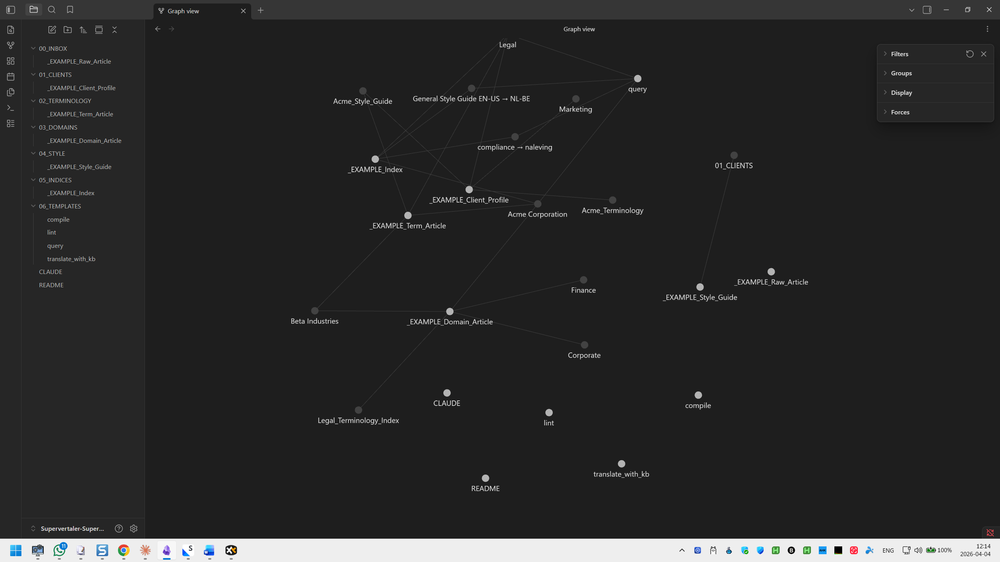

# SuperMemory

**SuperMemory** is Supervertaler's self-organising translation knowledge base system – a [Karpathy-inspired](https://venturebeat.com/data/karpathy-shares-llm-knowledge-base-architecture-that-bypasses-rag-with-an) feature that captures the reasoning behind your translation decisions and makes it available to the AI on every translation. Where a translation memory gives the AI previous wordings and a termbase gives it approved term pairs, SuperMemory gives it the _why_: client preferences, rejected alternatives, domain conventions, style rules, and the accumulated institutional knowledge for each piece of work.

Knowledge inside SuperMemory is organised into one or more **memory banks** – self-contained folders that each act as an Obsidian-compatible vault. You can keep a single default bank, or several banks side by side (one per client, one per domain, one per language pair) and switch between them in one click from the Supervertaler Assistant toolbar. This page covers both SuperMemory as a system and how to work with the memory banks inside it.

SuperMemory is one of several [context sources](context-awareness.md) the assistant consults when it translates a segment, drafts a prompt, or answers a chat message. It sits alongside termbases, translation memories, document content, and segment metadata – the five sources compose freely, and the AI reads from whichever ones are enabled in AI Settings.

Each memory bank is built on [Obsidian](https://obsidian.md/) and stored as interlinked Markdown files on disk, so it is human-readable, portable, and future-proof. You can edit a bank in any text editor, version-control it with Git, and sync it between machines with Dropbox or OneDrive.

<figure><figcaption><p>A memory bank knowledge graph showing interconnected clients, terminology, and domain knowledge</p></figcaption></figure>

## How knowledge is organised

Every memory bank has the same seven-folder skeleton. The skeleton is created automatically when you make a new bank, and it is shared byte-for-byte with the Python Supervertaler Assistant – so a bank created in Trados works unchanged in the standalone app and vice versa.

| Folder | Contents |
| ------ | -------- |
| `00_INBOX`       | Raw material – drop zone for unprocessed briefs, feedback notes, glossaries, reference articles |
| `01_CLIENTS`     | Client profiles: language preferences, style rules, terminology decisions, project history |
| `02_TERMINOLOGY` | Term articles with approved translations, rejected alternatives, and the reasoning behind each choice |
| `03_DOMAINS`     | Domain-specific conventions and common pitfalls (legal, medical, technical, marketing, financial) |
| `04_STYLE`       | Style guides, formatting rules, register notes, localisation conventions |
| `05_INDICES`     | Auto-generated indexes and maps of content |
| `06_TEMPLATES`   | Reusable templates for new articles |

The assistant loads content from `01_CLIENTS`, `02_TERMINOLOGY`, `03_DOMAINS`, and `04_STYLE` as context before each AI call. `00_INBOX`, `05_INDICES`, and `06_TEMPLATES` are workflow folders – they do not feed the AI directly, they support the processing pipeline. See [AI Integration](super-memory/ai-integration.md) for the full loading algorithm.

## Creating and switching banks

### Where banks live on disk

All of your memory banks live under a single parent folder – the **memory banks folder** – which defaults to:

```
C:\Users\{you}\Supervertaler\memory-banks\
```

Each bank is a subfolder with the seven-folder skeleton shown above:

```
memory-banks\
├── default\
│   ├── 00_INBOX\
│   ├── 01_CLIENTS\
│   └── …
├── acme-legal\
│   ├── 00_INBOX\
│   └── …
└── pharma\
    └── …
```

A fresh install ships with one empty bank named `default`. You can keep that as your only bank, rename it (see below), or add others alongside it.

### Switching banks

The **Memory Bank** dropdown in the Supervertaler Assistant toolbar lists every bank it finds under the memory banks folder. The one you pick is the **active bank** – the assistant reads from it until you choose another. Switching is immediate: the next chat turn, the next batch translation, and the next Process Inbox run all use the new bank. No restart needed, and your chat history is preserved across the switch.

The active bank persists across Trados sessions. If you close Trados with `acme-legal` selected, it will still be `acme-legal` when you reopen.

### Creating a new bank

To create a new bank without leaving the chat panel:

1. Click the **Memory Bank** dropdown in the Supervertaler Assistant toolbar.
2. Scroll to the bottom of the list and choose **+ New memory bank…**
3. A small dialog appears asking for a short name. Valid names are lowercase letters, digits, hyphens, or underscores – for example, `legal`, `medical`, `acme-corp`, `eu_procurement`. As you type, the dialog shows a live preview of the folder name that will be created.
4. Click **Create**. The new bank is created on disk with the full seven-folder skeleton, the dropdown refreshes to show it, and the assistant switches to it immediately.

A confirmation banner appears in the chat summarising what was created.

### Renaming and deleting banks

Renaming and deleting banks from inside the plugin is not yet available. Until those land, you can rename or delete a bank folder directly under `memory-banks\` using File Explorer, with Trados closed. Be sure to update `AiSettings.ActiveMemoryBankName` in your settings file if you rename the active bank, or simply switch to another bank from the toolbar dropdown the next time you open Trados.

## Why run several banks

A single `default` bank is enough if you work with one client or one domain. But most working translators will benefit from splitting their knowledge across several banks – one per major client, or one per domain, or one per language pair – because:

- **Context stays sharp.** The AI's context window is finite. A focused bank for a single client fits entirely in the prompt; a monolithic bank covering ten clients either exceeds the budget or has to be aggressively pruned before loading, losing detail.
- **Switching is instant.** When you move from translating a pharma clinical trial to a tech product manual, you want the AI to forget the pharma terminology immediately. Switching banks does that in one click.
- **Confidentiality is structural.** A bank for Client A physically cannot leak into a translation for Client B because the folders are separate on disk. No accidental cross-contamination.
- **Backups and syncing are per-client.** You can version-control, archive, or share a single client bank without exposing your other clients' data.

Typical layouts:

- **One bank per major client** – `acme-legal`, `novartis`, `eu-commission`, plus a small `default` for one-off work.
- **One bank per domain** – `legal`, `medical`, `technical`, `marketing`.
- **One bank per language pair** – `nl-en`, `de-en`, `fr-en` if your domains are similar across clients but the style and terminology vary by direction.

## Sharing banks with the Python Supervertaler Assistant

Memory banks are stored in the **shared Supervertaler data folder** – the same folder the Python Supervertaler Assistant uses – so banks created on either side are immediately visible to the other. The folder layout, skeleton, and naming rules are identical byte-for-byte. You can create a bank in the Python assistant, drop files into its inbox from the web clipper, and then switch to it from the Trados plugin; both products will see the same articles.

The shared folder also means you can keep your memory banks in a cloud-synced location (OneDrive, Dropbox, iCloud) and have the same banks available on any machine where either product is installed.

## Working with a memory bank

Once a bank exists, you fill it with knowledge in one of several ways:

1. **Drop Markdown notes into `00_INBOX`** – client briefs, glossaries, feedback notes, style guides, reference articles you have written down as `.md` files. These are compiled by Process Inbox.
2. **Use [Distill](super-memory/distill.md)** for everything that is **not** plain Markdown – TMX translation memories, DOCX style guides, PDF reference documents, XLSX/CSV glossaries, MultiTerm termbases. Distill reads each file and writes draft Markdown articles into `00_INBOX/`, ready for Process Inbox to compile.
3. **Use [Quick Add](super-memory/quick-add.md)** (Ctrl+Alt+M) to capture a terminology decision or correction while translating. Quick Add appends a short note to the inbox so you can keep working without context-switching.
4. **Run [Process Inbox](super-memory/process-inbox.md)** periodically. The AI reads every Markdown file in `00_INBOX` and files it into `01_CLIENTS`, `02_TERMINOLOGY`, `03_DOMAINS`, or `04_STYLE` as structured articles, interlinked with backlinks.
5. **Run [Health Check](super-memory/health-check.md)** when the bank starts to feel stale. It scans for conflicting terminology, broken links, stale content, and missing cross-references – and heals what it can.

The result is a knowledge graph that grows with your work and that the AI consults before every translation.


**Markdown vs binary files in the inbox.** Process Inbox is a Markdown compiler – it reads `.md` files only. Distill is the feature that reads binary formats (TMX, DOCX, PDF, XLSX, termbases) and turns them into Markdown. If you drop a TMX or PDF in `00_INBOX/` directly, Process Inbox will spot it and tell you to run Distill on it instead, rather than silently ignoring the file. See [Process Inbox](super-memory/process-inbox.md#markdown-only-use-distill-for-everything-else) for the full table.


### Templates and the heal-on-activation prompt

Process Inbox and Health Check are driven by AI prompts that live inside each bank under `06_TEMPLATES/` (`compile.md` and `lint.md` respectively). The plugin ships these template files as built-in defaults, and `+ New memory bank…` writes them automatically into every newly created bank.

If you activate an older bank that is missing one of these template files – for example a bank you created before template bundling shipped, or one where you deleted a template by accident – the plugin shows a one-time *"Missing memory bank templates"* dialog offering to restore the missing files from the built-in defaults. Click **Yes** and the bank is fixed in place; click **No** and the plugin leaves the bank alone (you can switch away and back to see the prompt again). Existing template files are never overwritten – only missing ones are written – so your per-bank edits are safe.

## Features

| Feature | Description |
|---------|-------------|
| **[Quick Add](super-memory/quick-add.md)** | Capture terms and corrections while translating (Ctrl+Alt+M) |
| **[Process Inbox](super-memory/process-inbox.md)** | Organise raw material into structured KB articles |
| **[Health Check](super-memory/health-check.md)** | Scan and repair the knowledge base |
| **[Distill](super-memory/distill.md)** | Extract knowledge from translation files (TMX, DOCX, PDF, termbases) |
| **[Active Prompt](super-memory/active-prompt.md)** | Per-project prompt that Quick Add appends terminology to |
| **[AI Integration](super-memory/ai-integration.md)** | How the memory bank enhances translations and chat |
| **[Obsidian Setup](super-memory/obsidian-setup.md)** | Installing Obsidian and the Web Clipper |

## Related

- **[Context Awareness](context-awareness.md)** – the full menu of context sources the assistant uses, with memory banks as one section among several.
- **[AI Integration](super-memory/ai-integration.md)** – the loading algorithm, token budget, and article prioritisation when a memory bank is consulted by the AI.
- **[AI Settings](../settings/ai-settings.md)** – toggles for enabling or disabling memory bank context.

## Learn more

The memory bank design is inspired by Andrej Karpathy's [LLM Knowledge Base](https://venturebeat.com/data/karpathy-shares-llm-knowledge-base-architecture-that-bypasses-rag-with-an) architecture. Templates for the seven-folder skeleton are available on [GitHub](https://github.com/Supervertaler/Supervertaler-SuperMemory) (the repository still uses the project's original name).
