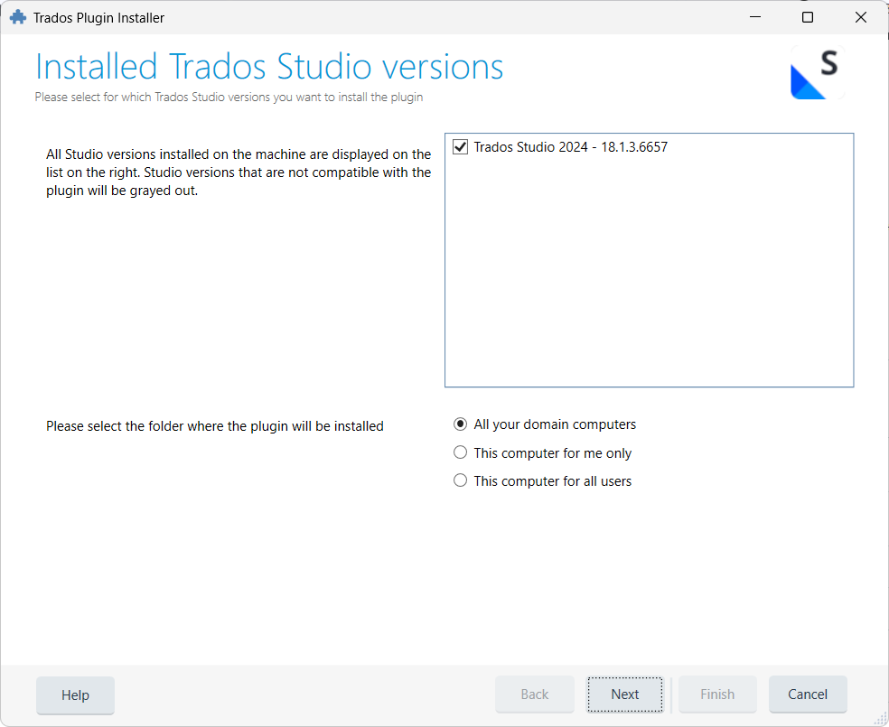

# Installation

## Download

1. Go to the [GitHub Releases](https://github.com/Supervertaler/Supervertaler-for-Trados/releases) page
2. Download the latest `Supervertaler.Trados.sdlplugin` file

## Install

1. **Close Trados Studio** if it is running
2. **Double-click** the downloaded `Supervertaler.Trados.sdlplugin` file
3. The Trados Plugin Installer opens — select your Trados Studio version and choose an installation location:

<figure><figcaption>The Trados Plugin Installer lets you choose which Trados version to install for and where to place the plugin.</figcaption></figure>

4. Click **Next**, then **Finish** to complete the installation
5. **Start Trados Studio** — the plugin loads automatically

### Installation locations

The installer offers three options for where to place the plugin:

| Option | Location | When to use |
|--------|----------|-------------|
| **All your domain computers** | `C:\Users\<user>\AppData\Roaming\Trados\Trados Studio\18\Plugins\` | Default. Works on domain-joined PCs where your roaming profile syncs across machines. |
| **This computer for me only** | `C:\Users\<user>\AppData\Local\Trados\Trados Studio\18\Plugins\Packages\` | Single machine, current user only. |
| **This computer for all users** | `C:\ProgramData\Trados\Trados Studio\18\Plugins\Packages\` | Shared machine — all Windows users on this PC get the plugin. |


Most users should select **"This computer for me only"** unless you specifically need the plugin available across domain computers or for all users on a shared machine.


## Verify Installation

After restarting Trados Studio, open a project in the Editor view. You should see:

- **TermLens panel** — docked above the editor area (or in the bottom panel area)
- **Supervertaler Assistant panel** — docked on the right side

### If the TermLens panel is not visible

Go to **View > TermLens** to show the panel.

### If the Supervertaler Assistant panel is not visible

Go to **View > Supervertaler Assistant** to show the panel.


Both panels are standard Trados dockable panels. You can drag them to any docking position (left, right, top, bottom, floating) or move them to a second monitor. Trados remembers their position between sessions.


## Updating

To update to a newer version:

1. Download the latest `Supervertaler.Trados.sdlplugin` file from [GitHub Releases](https://github.com/Supervertaler/Supervertaler-for-Trados/releases)
2. **Close Trados Studio completely** — the plugin files are locked while Trados is running
3. Double-click the new `.sdlplugin` file — the Trados Plugin Installer handles the rest
4. Start Trados Studio — it detects the updated package and loads the new version automatically

The new version cleanly replaces the previous installation. Your settings, termbases, and licence key are all preserved — no need to uninstall first.


Trados Studio **must be fully closed** before installing or updating. If Trados is still running, the installer may silently fail because the plugin files are locked.


## Troubleshooting: old version still showing after update

If Trados still loads an older version of the plugin after installing a new one, an old copy may be lingering in a different installation location. Check all three plugin folders and remove any old `Supervertaler.Trados.sdlplugin` (in `Packages`) and `Supervertaler.Trados` folder (in `Unpacked`):

| Folder | Path |
|--------|------|
| Roaming | `%AppData%\Trados\Trados Studio\18\Plugins\Packages\` |
| Local | `%LocalAppData%\Trados\Trados Studio\18\Plugins\Packages\` |
| All users | `%ProgramData%\Trados\Trados Studio\18\Plugins\Packages\` |


**Quick way to check:** paste each path into the Windows Run dialog (`Win+R`) or File Explorer address bar. If the folder exists and contains an old `Supervertaler.Trados.sdlplugin`, delete it. Also check for an `Unpacked\Supervertaler.Trados` folder at the same level and delete it if present.


After removing the old files, double-click the new `.sdlplugin` to install it fresh, then start Trados.

## Uninstalling

To remove the plugin:

1. Open Trados Studio
2. Go to **Help > Plugin Management**
3. Find "Supervertaler for Trados" in the list
4. Click **Uninstall**
5. Restart Trados Studio

---

## Next Steps

- [Getting Started](getting-started.md) — set up your first termbase and API key
