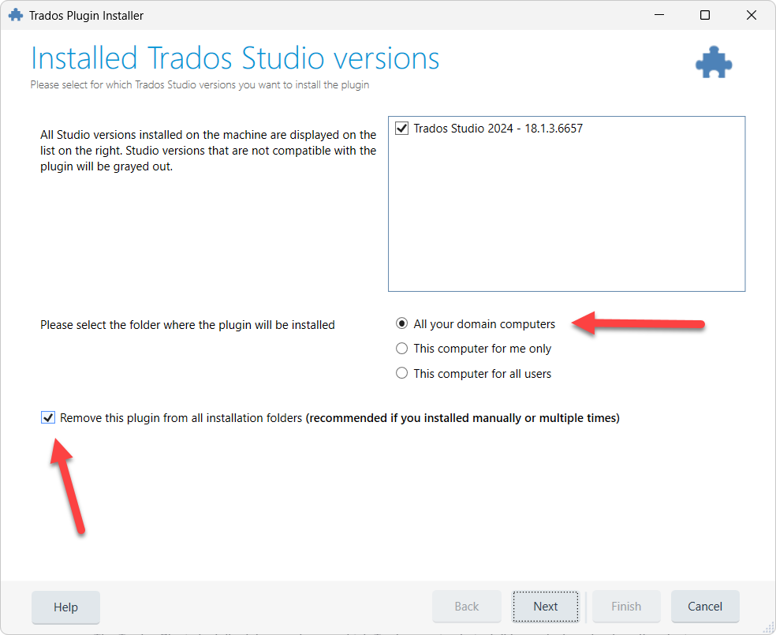


You are viewing help for **Supervertaler for Trados** – the Trados Studio plugin. Looking for help with the standalone app? Visit [Supervertaler Workbench help](https://help.supervertaler.com).


## Installation

### Download

Install Supervertaler for Trados from the [RWS App Store](https://appstore.rws.com/plugin/432) – it's the only supported install channel. Every published build is RWS-signed, which avoids the "Unsigned Trados Studio Plug-in Found" warning that would otherwise appear when Trados loads a plugin from a different source.

You can either install from inside Trados Studio (**Add-Ins > RWS App Store**, search for "Supervertaler", click **Download**) or download the `Supervertaler for Trados.sdlplugin` file from the [App Store website](https://appstore.rws.com/plugin/432) and double-click it. Either path opens the Trados Plugin Installer.


The [GitHub repository](https://github.com/Supervertaler/Supervertaler-for-Trados) is for source-code review, release notes, and issue tracking only. GitHub releases no longer include a `.sdlplugin` binary attachment – the App Store is the single source of truth for the plugin binary.


### Install

1. **Close Trados Studio** if it is running
2. **Double-click** the downloaded `Supervertaler for Trados.sdlplugin` file
3. The Trados Plugin Installer opens – select your Trados Studio version and choose an installation location:

<figure><figcaption>
The Trados Plugin Installer lets you choose which Trados version to install for and where to place the plugin.
</figcaption></figure>

4. Click **Next**, then **Finish** to complete the installation
5. **Start Trados Studio** – the plugin loads automatically

#### Installation locations

The installer offers three options for where to place the plugin. Each option stores the plugin in a different Windows folder, which determines who can use it and whether it follows you to other computers.

**"All your domain computers"** (default) : Installs to: `C:\Users\<user>\AppData\Roaming\Trados\Trados Studio\18\Plugins\Packages\` : The Windows **Roaming** profile folder. In environments that sync the Roaming profile across machines – classic Active Directory roaming profiles, FSLogix profile containers, and similar setups – the plugin follows your Windows account from one PC to another. (OneDrive Known Folder Move does **not** sync `AppData\Roaming` by default, so OneDrive on its own is not a roaming mechanism.) On a single-PC personal install without any profile-sync setup, the plugin simply stays on the machine – functionally similar to "This computer for me only", though the folder is still `Roaming` rather than `Local`, which can matter if the machine later joins a profile-sync environment.

**"This computer for me only"** : Installs to: `C:\Users\<user>\AppData\Local\Trados\Trados Studio\18\Plugins\Packages\` : The Windows **Local** profile folder. The plugin stays on this specific machine and is only available to your Windows user account. If another person logs into the same PC with a different Windows account, they will not have the plugin.

**"This computer for all users"** : Installs to: `C:\ProgramData\Trados\Trados Studio\18\Plugins\Packages\` : The shared **ProgramData** folder. The plugin is available to every Windows user account on this machine. Use this on shared workstations where multiple people log in with their own Windows accounts and all need the plugin. Rarely needed for most translators.


**Which should I choose?** **Just leave it on the default** ("All your domain computers") and click Next. The dialogue always opens with this option pre-selected and it works correctly for everyone. On a single-PC personal install it behaves the same as "This computer for me only" in practical terms (the plugin loads identically) – the only real difference is the install folder (`Roaming` vs `Local`), which only matters in environments that sync the Roaming profile across machines. **All three options work fine** – pick a different one only if you have a specific reason. As long as the **"Remove this plugin from all installation folders"** checkbox stays ticked (it is by default), any orphan-copy issues from previous installs are cleaned up automatically, regardless of which option you pick.


#### "Remove this plugin from all installation folders" checkbox

The Trados Plugin Installer shows a checkbox below the install-scope radio buttons:

> ☑ **Remove this plugin from all installation folders** _(recommended if you installed manually or multiple times)_

It is ticked by default. **Always leave it ticked.** Before placing the fresh install in the location you've selected, the installer sweeps all three locations (Roaming, Local, ProgramData) and removes any existing Supervertaler copies. On a first-time install there's nothing to remove and the checkbox is a harmless no-op; on an upgrade or after a previous manual install, it prevents the multi-scope-orphan problem where Trados ends up with two copies of the plugin in different folders and loads the wrong one on next start.

### Verify Installation

After restarting Trados Studio, open a project in the Editor view. You should see:

* **TermLens panel** – docked above the editor area (or in the bottom panel area)
* **Supervertaler Assistant panel** – docked on the right side

#### If the TermLens panel is not visible

Go to **View > TermLens** to show the panel.

#### If the Supervertaler Assistant panel is not visible

Go to **View > Supervertaler Assistant** to show the panel.


Both panels are standard Trados dockable panels. You can drag them to any docking position (left, right, top, bottom, floating) or move them to a second monitor. Trados remembers their position between sessions.


### Running on a Mac (Parallels)

If you are running Trados Studio inside **Parallels Desktop** on a Mac, there is one important rule for the first-run setup:

**Keep your data folder on the Windows side** – use the default path (e.g., `C:\Users\<username>\Supervertaler`). Do **not** point it to a Mac-side path like `\\Mac\Home\Supervertaler`.

Supervertaler stores termbases as SQLite databases, and SQLite requires a local filesystem to work reliably. The `\\Mac\Home\...` paths in Parallels are mounted via a virtual network share, which can cause database locking errors or data loss.


**Mac users:** When the first-run setup dialogue appears, accept the default `C:\Users\<username>\Supervertaler` path. If you previously used Supervertaler Workbench on the Mac side, copy your termbases into the Windows-side folder rather than pointing to the Mac path directly.


The plugin automatically detects Parallels and shows a warning if you select a Mac-side path during setup.

#### Sharing termbases between Workbench and the Trados plugin on a Mac

On Windows, both Supervertaler Workbench and the Trados plugin can point to the same shared data folder and work from the same `.db` termbase file simultaneously.

On a Mac with Parallels, this is **not possible** because the two products run on different filesystems:

- **Supervertaler Workbench** runs natively on macOS – its data folder is on the Mac filesystem (e.g., `/Users/<username>/Supervertaler/`)
- **Supervertaler for Trados** runs inside Parallels (Windows) – its data folder must be on the Windows filesystem (e.g., `C:\Users\<username>\Supervertaler\`)

The Trados plugin cannot reliably use a Mac-side path (`\\Mac\Home\...`) due to SQLite limitations on virtual network shares. To keep your termbases in sync between the two products on a Mac, copy the `.db` file from one side to the other after making changes. This is a limitation of the Parallels virtualisation layer, not of the termbase format.

***

### Updating

When a new version is published to the App Store, Supervertaler shows an **Update Available** dialogue on the next Trados startup, with the version difference and an **Install Update** button.

1. Click **Install Update** – the plugin downloads the RWS-signed update from the App Store and writes it back to the same install scope (Roaming, Local, or ProgramData) you originally chose during installation
2. When prompted, click **Restart Trados Studio** – the plugin restarts Trados for you and loads the new version

Your settings, termbases, prompts, memory banks, and licence key are all preserved across updates – no need to uninstall first.

#### Manual update from the App Store website

If you've dismissed the in-plugin dialogue (for example, by clicking **Remind Me Later**) and want to update straight away, you can install manually from the App Store website:

1. **Close Trados Studio completely** – the plugin files are locked while Trados is running
2. Open the [App Store page for Supervertaler](https://appstore.rws.com/plugin/432) and click **Download** to save the latest `Supervertaler for Trados.sdlplugin`
3. Double-click the file – the Trados Plugin Installer handles the rest
4. Start Trados Studio – the new version loads automatically


Trados Studio **must be fully closed** before installing or updating manually. If Trados is still running, the installer may silently fail because the plugin files are locked.


### Troubleshooting: old version still showing after update


From **v4.19.24** onwards the in-plugin updater is install-scope aware – it writes updates back to the same scope (Roaming, Local, or ProgramData) as the original install, so this scenario does not occur for automatic updates. The steps below remain useful if you have inherited a multi-scope install from an earlier version, or have placed `.sdlplugin` files manually in different locations.



**Easiest fix:** download the latest `.sdlplugin` from the [App Store page](https://appstore.rws.com/plugin/432), close Trados, double-click the file, and tick the **"Remove this plugin from all installation folders"** checkbox when it appears in the installer. The Trados Plugin Installer will sweep all three install scopes and replace everything with the fresh copy in one step. Manual cleanup steps below are only needed if that path doesn't work for some reason.


If Trados still loads an older version of the plugin after installing a new one, an old copy may be lingering in a different installation location. Check all three plugin folders and remove any old `Supervertaler for Trados.sdlplugin` (in `Packages`) and `Supervertaler.Trados` folder (in `Unpacked`):

| Folder    | Path                                                       |
| --------- | ---------------------------------------------------------- |
| Roaming   | `%AppData%\Trados\Trados Studio\18\Plugins\Packages\`      |
| Local     | `%LocalAppData%\Trados\Trados Studio\18\Plugins\Packages\` |
| All users | `%ProgramData%\Trados\Trados Studio\18\Plugins\Packages\`  |


**Quick way to check:** paste each path into the Windows Run dialogue (`Win+R`) or File Explorer address bar. If the folder exists and contains an old `Supervertaler for Trados.sdlplugin`, delete it. Also check for an `Unpacked\Supervertaler for Trados` folder at the same level and delete it if present.


After removing the old files, double-click the new `.sdlplugin` to install it fresh, then start Trados.

### Uninstalling

To remove the plugin:

1. Open Trados Studio
2. Go to **Help > Plugin Management**
3. Find "Supervertaler for Trados" in the list
4. Click **Uninstall**
5. Restart Trados Studio

***

### Next Steps

* [Getting Started](getting-started.md) – set up your first termbase and API key
